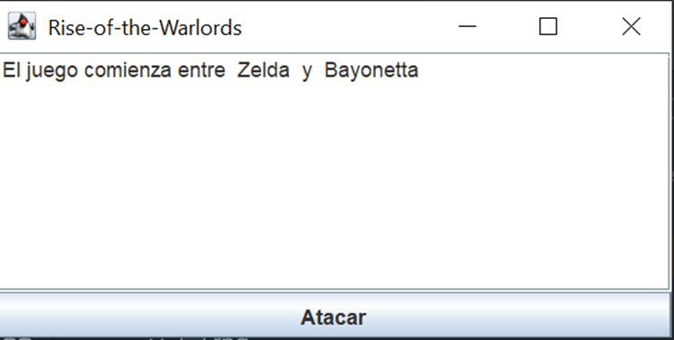
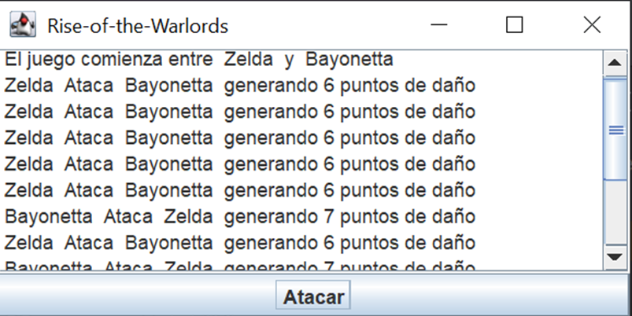
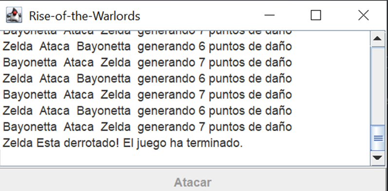

# Rise-of-the-Warlords
Elaboración de un prototipo de videojuego llamado "Rise of the Warlords

Este proyecto esta integrados por 5 estudiantes, que a continuación se presentan:

*Bautista Castro Jaime

*Belmontes Mondragón María

*Davíla Ríos José Francisco

*Lara Sanchez Diego

*Sanchez Lara Arantza Pamela 

Comenzaremos a detallar nuestro prototipo del videojuego, es decir, que funciones y proposito tiene ese mismo.

Dicho videojuego va a constar de dos personajes, los cuales estaran en batalla por el triunfo, siendo asi que en cada partida estos ya sea que ganen o pierdan puntos, terminando este en el momento en el que alguno de los dos personajes quede sin vida, cabe aclarar que cada personaje contara con poderes o armamento distinto, lo cual hara que la batalla sea aun mas epica, competitiva y emocionante.

